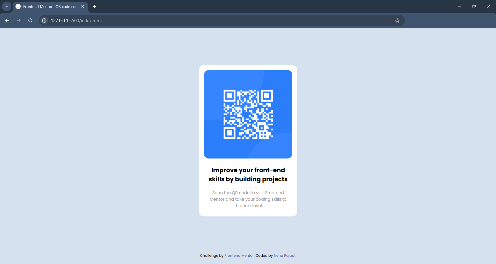

# QR-code-component

Building a card layout using just HTML &amp; CSS

# Frontend Mentor - QR code component solution

This is a solution to the [QR code component challenge on Frontend Mentor](https://www.frontendmentor.io/challenges/qr-code-component-iux_sIO_H).

## Table of contents

- [Overview](#overview)
  - [Screenshots](#screenshots:)
  - [Links](#links)
- [My process](#my-process)
  - [Built with](#built-with)
  - [What I learned](#what-i-learned)
  - [Continued development](#continued-development)
  - [Useful resources](#useful-resources)
- [Author](#author)
- [Acknowledgments](#acknowledgments)

## Overview

I've built a QR code card component using just HTML & CSS. It's simple, chic & not responsive (YET)! (I'll work on building some more responsive web pages in my learning journey ahead!)

### Screenshots:

#### Goal:

#### Result:

## My process

- The process was tiring honestly. Because this was my first project outside of a tutorial.
- I first decided on the layout technique.
- Initially I had implemented the layout using flex-box layout but then that seem to work out (maybe because I need to learn it more properly), so I implemented regular box layout using margins & paddings and somehow centered the card.

### Built with

- HTML & CSS only!

### What I learned

This helped me learn how to make simple layout with just basic style attributes.

### Continued development

Implementing comple layouts using different layout techniques like flexbox, grid etc.

### Useful resources

- [MDN docs](https://developer.mozilla.org/en-US/docs/Web/CSS)

## Author

- [@rnehacodes](https://www.frontendmentor.io/profile/rnehacodes)
